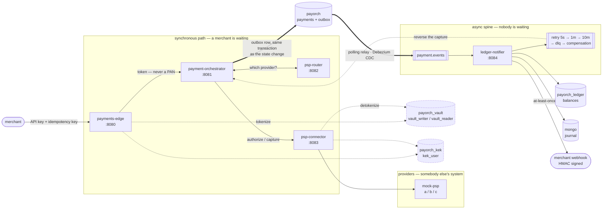

# Payment Orchestrator

A locally-runnable, chaos-tested multi-PSP payment orchestration platform.

Built in phases, where each resilience component is added **only after the
failure it prevents has been observed and measured**. Every phase from 3 onward
produces a before/after graph in [`docs/experiments/`](docs/experiments/).

> **Status: phases 0–4 complete, phase 5 all but one criterion, phase 6 complete
> — every exit criterion met and measured.** Twenty-two experiments with a measured
> before and after in [`docs/experiments/`](docs/experiments/), and eight
> decision records in [`docs/adr/`](docs/adr/) — two of which conclude against
> the component they document.

## The system



**The dashed edges are the only paths a card number travels.** It exists in
exactly three places — `payments-edge` at intake, `payorch_vault` at rest, and
`psp-connector` for the duration of one provider call — and the two databases
carry disjoint credentials, so no single account yields both the ciphertext and
the key that opens it. Everything to the right of the edge holds a token.

**The double line is the atomicity boundary.** The payment's state change and
the fact that an event is owed are one transaction against one database; the
relay turns the second into a consequence of the first rather than a sibling of
it. [Experiment 10](docs/experiments/10-outbox.md) measures what the naive
version costs: 20 of 60 payments lost their events, permanently, in a 30-second
broker outage.

## The graph

A provider degraded to 80% errors, mid-run, under sustained load. The same
system, twice — the only difference is who decides where a payment goes.

**Before — static priority routing** (phase 1's rule: first enabled provider by
`priority`)

```
                      v                  ^
            v = fault injected   ^ = provider healed

  share of payments routed to each provider
  psp-a       ██████████████████████████████████████   avg   93%

  end-user success rate, same clock
  success   ??██▇▇█▇▇█▇▁          ▁ ▁      ▆█▇▇▇█▇██?    47% mean

  before fault  99.7%   during   4.2%   after  78.8%
```

Two healthy providers sat idle while **95.8% of payments failed**. The routing
decision was made once, from a column, and nothing in the system could revise it.

**After — health-weighted routing** (phase 5: the breaker's state is an *input*,
not an outcome)

```
                      v               ^
            v = fault injected   ^ = provider healed

  share of payments routed to each provider
  mockpsp        ▁▁▁▁▁▁▁▁▁▁▁▁▁▁▁▁▁▁▁▁▁▁▁▁▁▁▁▁▁▁    avg    4%
  psp-a      ▆▆▆▆▆▆▆▅▆▄ ▁  ▁ ▁ ▁          ▁▄▆▆▆▅   avg   29%
  psp-b      ▁▁▁▁▁▁▁▁▁▁▂▂▂▂▂▂▂▂▂▂▂▂▂▂▂▂▂▂▂▂▁▁▁▁▁   avg   13%
  psp-c      ▂▂▂▂▂▂▂▂▂▃▆▆▆▆▅▆▆▆▆▆▆▆▆▆▆▆▆▆▆▆▃▂▂▁▂   avg   49%

  end-user success rate, same clock
  success   ?▇▇▇▇▇▇▇▇▆▄▇▇▇▇▇▇▇▇▇▇▇▇▇▇▇▇▇▇▇▇▇▇▇▇█?    95% mean

  before fault  95.2%   during  92.2%   after  97.1%
```

Traffic leaves the failing provider in **7 seconds** and the success rate barely
moves. Both charts are drawn by
[`tools/loadtest/plot-routing.py`](tools/loadtest/plot-routing.py) from
`payment_attempt` rows, and **both show the error rate on the same clock as the
traffic** — deliberately, because a graph showing only the traffic move is the
most flattering possible picture of a system that failed its users.

**What the graph does not claim.** The dip is real: 97.5% → 91.2% on the tuned
run. About 4 points of that is the cost of probing a broken provider with live
payments, which is what makes automatic recovery possible at all — routing is
where the circuit breaker's probes come from. The rest is that the providers
traffic lands on are contractually worse. "No spike at all" is achievable only
by giving up automatic recovery, and that criterion is left explicitly unticked
in [phase 5](docs/phases/05-health-routing.md). The full accounting is
[experiment 09](docs/experiments/09-health-routing.md).

---

## Requirements

| | |
|---|---|
| JDK | 25 (toolchain is pinned; `JAVA_HOME` must be a JDK 25) |
| Docker | Engine 29+ with Compose v2 |
| Gradle | none - use the wrapper |

### Cloning on Windows

Run this once, or the clone silently fails to check out four files:

```bash
git config --global core.longpaths true
```

Spring's autoconfiguration registration file
(`META-INF/spring/org.springframework.boot.autoconfigure.AutoConfiguration.imports`)
pushes those paths past the 260-character `MAX_PATH` limit. The failure is
quiet in the worst way: `git clone` reports "Filename too long" but still
leaves a repo behind, and `./gradlew build` on the half-checked-out tree
reports BUILD SUCCESSFUL because there is almost nothing left to build.

## Run it

```bash
./gradlew build          # compiles, runs ALL tests - including infra-core's
./gradlew bootJar        # produces one runnable jar per service
docker compose up -d --build
```

> **Upgrading from a phase-0 checkout?** Run `docker compose down -v` first.
> The token vault's database, table and credentials are created by
> `docker/mysql/init/01-vault.sql`, and MySQL runs that script **only** on the
> first start against an empty data directory. On a volume that predates it,
> `payments-edge` refuses to start and says so.

`build` at the root explicitly depends on `infra-core:buildAll`. Without that
dependency Gradle runs no tests in the included build at all, because the
services need the starters' jars and nothing more.

The Docker images copy a jar built on the host rather than building inside a
builder stage, so `bootJar` must run first. See the comment at the top of
[`docker/Dockerfile`](docker/Dockerfile) for why.

Check everything came up:

```bash
docker compose ps
curl -s localhost:8080/actuator/health   # payments-edge
```

## Make a payment

The API key below is seeded by `V3__dev_seed.sql` and is public by design - it
is a local test credential.

```bash
curl -sX POST localhost:8080/v1/payments \
  -H 'Content-Type: application/json' \
  -H 'X-Api-Key: pk_test_dev_merchant_key' \
  -H 'Idempotency-Key: order-0001' \
  -d '{"amountMinor":1000,"currency":"INR","merchantReference":"order-1",
       "card":{"number":"4242424242424242","expiryMonth":12,"expiryYear":2030,"cvv":"123"}}'
```

```json
{"id":"01a004a8-86c4-764d-975b-7a6367bd5518","state":"AUTHORIZED","amountMinor":1000,
 "currency":"INR","cardBin":"424242","cardLast4":"4242","merchantReference":"order-1",
 "createdAt":"2026-08-15T09:02:28.579Z"}
```

Repeat that command with the same `Idempotency-Key` and a completely different
body: the response is **byte-identical** and no second payment is created.

Then `curl -s localhost:8080/v1/payments/<id> -H 'X-Api-Key: pk_test_dev_merchant_key'`.

### Reaching the other states

| Want | Do |
|---|---|
| `FAILED` (a decline) | send an `amountMinor` ending in `05`, e.g. `1005` |
| `UNKNOWN` (no answer) | `curl -XPOST localhost:8085/_chaos -H 'content-type: application/json' -d '{"latencyMs":0,"errorRate":1,"hangRate":0,"duplicateRate":0}'` |
| back to healthy | `curl -XDELETE localhost:8085/_chaos` |

`UNKNOWN` is the interesting one. The provider failed, so the outcome is not
known - the card may have been authorized and the response lost. It is
deliberately **not** `FAILED`; see [`PaymentState`](services/payment-orchestrator/src/main/java/com/payorch/orchestrator/domain/PaymentState.java).

### The chaos endpoint

`mock-psp-simulator` is reconfigurable at runtime, with no restart:

```bash
curl -XPOST localhost:8085/_chaos -H 'content-type: application/json' \
     -d '{"latencyMs":0,"errorRate":0.3,"hangRate":0,"duplicateRate":0}'
curl localhost:8085/_chaos          # what is active
curl -XDELETE localhost:8085/_chaos # reset
```

| Knob | Finds |
|---|---|
| `latencyMs` | missing deadline budgets, connection-pool exhaustion |
| `errorRate` | missing retries; what a circuit breaker counts |
| `hangRate` | **never responds** - missing read timeouts. A slow response frees the thread eventually; a hang does not |
| `duplicateRate` | missing provider-side idempotency - the failure that ends in a double charge |

### Verify it

```bash
k6 run tools/loadtest/smoke.js   # the phase-1 exit criteria, as checks
tools/panscan/pan-scan.sh        # zero Luhn-valid card numbers outside the vault
```

Run the scan *after* traffic has flowed. Scanning an idle stack proves nothing.

## Break it

Five chaos layers, and they are not interchangeable - Toxiproxy breaks the
**link**, Pumba breaks the **process**, `chaos-core` breaks the **bean**.

```bash
# downstream provider: latency, errors, hangs, duplicate authorizations
curl -XPOST localhost:8085/_chaos -H 'content-type: application/json'      -d '{"latencyMs":0,"errorRate":0.4,"hangRate":0,"duplicateRate":0}'

# the network to MySQL or Redis
tools/chaos/toxic.sh latency mysql 500
tools/chaos/toxic.sh clear-all

# this service's own beans
curl -XPOST localhost:8081/actuator/chaosbeans -H 'content-type: application/json'      -d '{"latencyMs":2000,"latencyRate":1.0,"exceptionRate":0}'

# the process
tools/chaos/pumba.sh sigterm payorch-psp-connector   # graceful drain
tools/chaos/pumba.sh kill    payorch-psp-connector   # no drain at all
tools/chaos/pumba.sh pause   payorch-psp-connector 20s
```

A whole experiment, with chaos reset either side and metrics captured
throughout:

```bash
CHAOS_LATENCY_MS=3000 MAX_RATE=200   tools/loadtest/run-experiment.sh 01-downstream-latency ramp.js
```

**Chaos without k6 concurrency is invisible.** A fault applied to an idle system
is merely a fault; it takes load to make it chaotic. See
[`docs/experiments/`](docs/experiments/).

### Compose profiles

| Profile | Contains | From |
|---|---|---|
| *(default)* | mysql, redis, payments-edge, payment-orchestrator, psp-router, psp-connector, mock-psp-simulator | phase 0 |
| `async` | + kafka x3 (KRaft), mongo, ledger-notifier | phase 6 |
| `obs` | SigNoz, attached over an external network - see the note in `docker-compose.yml` | phase 4 |

```bash
docker compose --profile async up -d
```

Profiles exist so ClickHouse is not booting during phases 1-3. Only the default
profile is covered by the phase-1 exit criteria.

## Services

| Service | Port | Owns |
|---|---|---|
| `payments-edge` | 8080 | REST, API-key auth, tokenization, idempotency, rate limiting, deadline budget origin |
| `payment-orchestrator` | 8081 | Payment state machine, MySQL, transactional outbox, saga coordination |
| `psp-router` | 8082 | Health-based provider selection |
| `psp-connector` | 8083 | All resilience. Provider adapters, per-provider config |
| `ledger-notifier` | 8084 | Kafka consumers to Mongo. Double-entry ledger, webhooks, reconciliation |
| `mock-psp-simulator` | 8085 | Chaos source. Latency, errors, hangs, duplicate responses |

## Repository layout

```
payment-orchestrator/
├── gradle/libs.versions.toml     one version catalog, shared by both builds
├── infra-core/                   a SEPARATE gradle build, wired via includeBuild
│   ├── logging-starter           structured JSON logging + PII masking
│   ├── web-starter               RFC-7807 errors + correlation-ID filter
│   ├── persistence-starter       UUIDv7 identifiers and their BINARY(16) form
│   ├── tokenization-starter      the token vault and the one detokenization path
│   ├── chaos-core                bean-level assaults and bespoke fault seams
│   ├── idempotency-starter       keys, replay; hardened in phase 7
│   ├── resilience-starter        empty until phase 3
│   └── observability-starter     empty until phase 4
├── services/                     the six Spring Boot applications
├── docker/
│   ├── Dockerfile                one shared image, selected by build arg
│   └── mysql/init/               provisions the vault schema and its credentials
├── docs/experiments/             one page per chaos experiment
├── tools/loadtest/               k6 profiles, metrics capture and the run harness
├── tools/chaos/                  Toxiproxy toxics and Pumba process chaos
└── tools/panscan/                the PAN-leak scan, seed of the phase-4 build test
```

### Why `infra-core` is an included build

`settings.gradle.kts` pulls it in with `includeBuild` and substitutes the
starter coordinates for local projects. Editing a starter is picked up by the
services on the next build - no publish step, no version bump. It is still a
standalone build, so `./gradlew -p infra-core publishToMavenLocal` produces real
snapshots when a pinned version is wanted instead.

---

## Data protection

The rules the code is built around, in force from phase 0 rather than added as a
cleanup pass:

- **Raw PAN never leaves the edge.** `payments-edge` tokenizes on arrival. Every
  downstream service, log line, Kafka message and database row carries
  `bin + token + last4` and nothing else. The card expiry lives in the vault too,
  and comes back with the PAN at detokenization time, so that sentence stays
  literally true rather than nearly true.
- **CVV is never stored.** Not encrypted, not hashed, not logged. In transit
  only, then discarded.
- **Allowlist, not denylist.** `LogEvent` accepts only field names declared in
  `LogFields`; an unknown name throws rather than being logged. A denylist fails
  silently the first time someone adds a field.

Masking is layered, and the layers are ordered by how much they are trusted:

| Layer | Mechanism | Role |
|---|---|---|
| 1 | Tokenization at the edge (phase 1) | The actual control. Card data does not exist downstream to be leaked. |
| 2 | `@Sensitive` + Jackson serializer | Masks marked fields wherever they are serialized - HTTP responses, event payloads, structured log arguments. |
| 3 | Luhn-validated regex over log output | Last-resort net for what layers 1 and 2 structurally cannot see: exception text, third-party libraries, hand-concatenated messages. |

Layer 3 is **not** the primary control and is not treated as one. It runs on
every value written to the JSON log output, and gates card-number masking behind
a Luhn checksum so that order IDs and trace IDs survive intact.

### The data flow, and where audit scope ends

```
  merchant                    IN SCOPE                       out of scope
     |          .-------------------------------.
     |  PAN     |                               |
     +--------->|  payments-edge                |
                |    Pan.of() validate          |
                |    TokenVault.tokenize()      |
                |         |                     |
                |         |  PAN + DEK          |
                |         v                     |
                |  token_vault  (own schema,    |
                |    AES-256-GCM  own creds)    |
                |    per-record DEK,            |
                |    wrapped by merchant KEK    |
                |         ^                     |
                |         | SELECT only         |
                |         |                     |
                |  psp-connector                |
                |    TokenVault.detokenize()    |
                |         |                     |
                '---------|---------------------'
                          |  PAN (in memory, one method)
                          v
                     PSP provider

     bin + token + last4 only, everywhere else:
     payment-orchestrator -- psp-router -- ledger-notifier
     Kafka topics -- MySQL payment rows -- Mongo journal -- log archives
```

Three components are in scope, and the boundary is enforced by three different
mechanisms rather than by one: **a database grant** (`vault_reader` has `SELECT`
and nothing else, the application user has no grant at all), **a method
signature** (only `authorize` accepts a `DetokenizedCard` — capture, reversal and
lookup reference the provider's own handle and have no parameter a card could
arrive through), and **a log allowlist** that throws on an unknown field name.

### How erasure propagates

Everything outside the box above holds `bin + token + last4`. None of it needs to
be found, visited or rewritten when a merchant asks to be erased — and that is
the point, because **an immutable Kafka log, a log archive and a backup tape
cannot be rewritten at all.** Copy-chasing is the approach that never actually
completes.

What happens instead is that the key is destroyed:

```
  erasure request for merchant M
            |
            v
  KekStore.forget("M")          <-- destroys every KEK version for M
            |
            +--> token_vault rows for M    : untouched, now meaningless
            +--> replica / binlog          : untouched, now meaningless
            +--> last night's backup       : untouched, now meaningless
            +--> Kafka events, log archives: never held a PAN anyway
```

**Deleting the mapping row is not enough**, and finding out why is the whole
design. A `DELETE` removes the row from the live table and from nothing else —
restore last night's backup and the mapping is back, so an erasure satisfied by a
delete is satisfied only until somebody restores. The thing destroyed therefore
has to be something that was never *in* the backup of the data: the key, held in
a different system with a different backup lifecycle.
`VaultRotationTest.restoringTheTableDoesNotUndoAnErasure` proves it by taking a
copy of the table, erasing, dropping every row, restoring the copy, and requiring
the card to still be unreadable.

Three properties make that work, each of which is easy to get subtly wrong:

| Property | Why it is required |
|---|---|
| **Per-merchant key scope** | One global KEK makes rotation cheap and erasure impossible — there is no key whose destruction removes *one* merchant. The scope has to be chosen when the card is first stored; records already wrapped under a shared key cannot be separated afterwards without decrypting every one. |
| **Keys generated, never derived** | `HKDF(master, merchantId)` needs no store and is *unshreddable* — anyone with the master re-derives a "destroyed" key. A key that can be recomputed cannot be forgotten. |
| **Scope bound into the wrap** | Otherwise an erased merchant's row can be relabelled into a live scope and read again, turning a completed erasure back into a breach with one `UPDATE`. |

Rotation uses the same machinery in the opposite direction: because each record
carries its own DEK, **rotating a KEK re-wraps 48 bytes per row and rewrites no
card ciphertext at all** — asserted byte-for-byte in `VaultRotationTest`. With a
single directly-applied key, rotation *is* a full re-encryption of every card,
which is why systems built that way do not rotate until an incident forces them.

**Not yet built:** the PII access audit log. "We encrypted it" does not answer
"who looked at it", and the second is the question auditors ask. The KEK store
shipped here is also in-memory — correct for demonstrating erasure, useless for
holding anything, since every merchant key dies on restart. Vault is the
production implementation and is outstanding.

### Where a card number actually exists

Being precise about this is worth more than overclaiming. There are three
places, not one:

| Where | When | Guarded by |
|---|---|---|
| `payments-edge` | at intake, for the few statements before tokenization | it is the only service that accepts one |
| `token_vault` | at rest, AES-256-GCM | a **separate database with its own credentials** - the application user has no grant on it at all |
| `psp-connector` | in memory, immediately before the provider call | credentials granted `SELECT` only; one audited reversal path in `TokenVault` |

Claiming "only one component sees a card number" invites an interviewer to find
the connector. Three components with one audited reversal path is the honest
version, and it is still a good story. The separation is a `GRANT`, not a
comment - `docker/mysql/init/01-vault.sql` is where it lives, and it is
demonstrable:

```bash
docker compose exec mysql mysql -upayorch -ppayorch \
  -e "SELECT COUNT(*) FROM payorch_vault.token_vault"
# ERROR 1142: SELECT command denied to user 'payorch'
```

`tools/panscan/pan-scan.sh` turns the claim into a check, using the same
`Masking.isLuhnValid` the runtime masking filter uses. Phase 4 promotes it into
a build test that runs the k6 suite against a live stack and fails the build if
any Luhn-valid card number appears in the captured output.

---

## Phases

Full implementation guide for each phase lives in
**[`docs/phases/`](docs/phases/)** - goal, build steps, key decisions, exit
criteria, traps and interview payload.

| Phase | | Est. | Status |
|---|---|---|---|
| 0 | [Foundations](docs/phases/00-foundations.md) - build, logging, compose skeleton | 1 wk | **done** |
| 1 | [Vertical slice](docs/phases/01-vertical-slice.md) - one payment, tokenization | 2 wk | **done** |
| 2 | [Chaos harness and load](docs/phases/02-chaos-harness.md) - the baseline failure report | 1 wk | **done** |
| 3 | [Resilience layer](docs/phases/03-resilience.md) - one component at a time | 3-4 wk | **done** |
| 4 | [Observability](docs/phases/04-observability.md) - SigNoz, trace/log correlation, PAN-leak test | 2 wk | **done** |
| 5 | [Health-driven routing](docs/phases/05-health-routing.md) - the differentiator | 2 wk | 5 of 6 criteria |
| 6 | [Async spine](docs/phases/06-async-spine.md) - Kafka, outbox, CDC, saga | 3 wk | **criteria met** - saga compensation remains |
| 7 | [Concurrency and idempotency](docs/phases/07-concurrency-idempotency.md) | 2-3 wk | |
| 8 | [Data layer depth](docs/phases/08-data-layer.md) - indexing, reconciliation | 2 wk | |
| 9 | [gRPC, security, data protection](docs/phases/09-grpc-security.md) | 3 wk | |
| 10 | [Packaging](docs/phases/10-packaging.md) - ADRs, writeups, demo script | 1 wk | |

The rule that holds across all of them: **never add a resilience component
without first observing the failure it prevents.** Break it, measure it, then
fix it.
